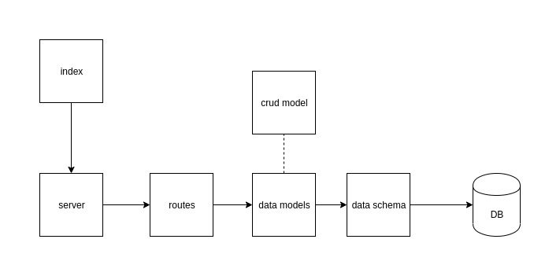

# Apprenti-401-Lab-10
Includes Labs 7, 8, and 9

## Final API Server

### Author: Lindsay Peltier

### Links and Resources
* [submission PR](https://github.com/LindsayPeltier-401-advanced-javascript/Apprenti-401-Lab-10/pull/1)
* [travis](https://www.travis-ci.com/LindsayPeltier-401-advanced-javascript/Apprenti-401-Lab-10)
* [back-end](https://apprenti-401-lab-10.herokuapp.com/)

#### Documentation
* [api docs](/Users/lpeltier/DevStation/devstation/401/labs/Apprenti-401-Lab-10/docs/swagger.json)
* [jsdocs](./docs)

### Setup
* npm init -y
* npm install

#### `.env` requirements
* `PORT` - Port Number
* `MONGODB_URI` - URL to the running mongo instance/db

#### How to initialize/run your server app (where applicable)
* Start App: `npm start`
* Endpoint: /api-docs
  * Returns api-documentation
* Endpoint: /docs
  * Returns JSdocs
* Endpoint: /api/v1/products
  * Returns all products
* Endpoint: /api/v1/products/:id
  * Returns specific products
* Endpoint: /api/v1/categories
  * Returns all categories
* Endpoint: /api/v1/categories/:id
  * Returns specific category
  
#### Tests
* Unit Tests: `npm test`
* Eslint: `npm run lint`

#### UML
